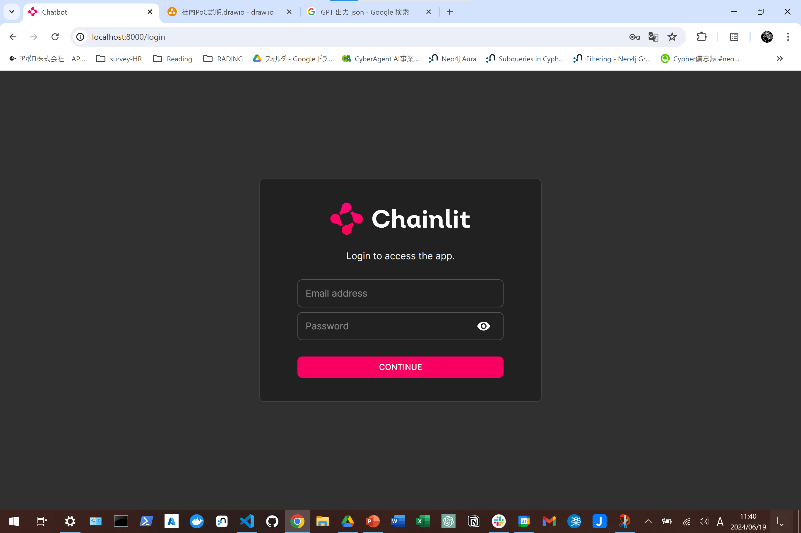
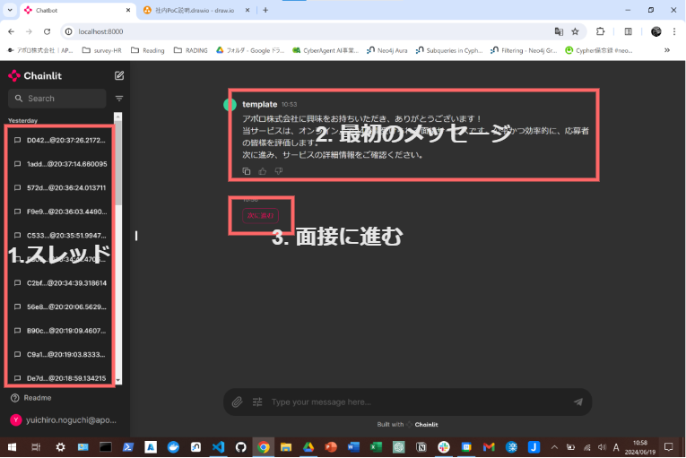
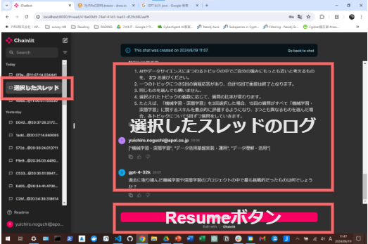

# GPT-interviewer
AI面接サービスは、応募者の方への質問をAIが行うサービスです。

AIとのやり取りを通して、
皆様の今までの取り組みや能力を聞かせていただきます。
そのため、24時間どこからでも応募が可能です。

この面接は、書類選考と一次面接に相当し、通過者は直接二次面接へ進んでいただけます。

AIは、あくまでも皆様とのやり取りをするために用いており、
選考上の合否判断は人間が行っております。
また、履歴書や職務経歴書無しで応募できるため、
学歴や職歴に関係なく、
AIとの質疑応答を通じてあなたのポテンシャルを重視して評価します。


## 社内PoCの目的
1. ガチ面接
    - 本気の面接受け答えのデータを集めたい
    - 説明の文章で分かりにくいところがないか
1. 色々遊んでみてもらう
    - 本気の面接から回答を分岐変化させた場合
    - 適当な回答をした場合
    - どのように応答が変化するかのデータを集めたい

## 社内PoCの始め方

### このリポジトリのmasterブランチをクローンする
 `git clone git@github.com:apol-yuichiro-noguchi/GPT-interviewer.git`

### クローンしたリポジトリに移動する
`cd GPT-interviewer`

### Pythonの仮想環境を作成し、アクティベートする
`python -m venv .venv`

```source .venv/bin/activate```

### 仮想環境に依存関係をインストールする
`pip install -r requirements.txt`

### chainlitコマンドでサーバーを立て、app.pyを走らせる
`chainlit run app.py -w`

### Webブラウザでloalhost:8000にアクセスする
`http://localhost:8000`

アポロのメールアドレスと、配布したパスワードでログインする。


## 操作の説明
### 1. ログイン


**手順**
1. http://localhost:8000にアクセスします。
1. 初回はログインを要求されます。
1. 配布した`email address`と`password`を入力します。

> ログイン出来ない場合は @apol-yuichiro-noguchi までご連絡ください。

### 2. スタート


こちらの画面に遷移したら、チャット部分に表示される指示やメッセージに従って面接を進めてください。

#### 1. スレッド
スレッドには、会話のログが記録されていきます。
記録が残っていない初回は、`emtpy`が表示されます。

表示されているスレッドをクリックすると、そのスレッド時点から遡った過去のチャットが、チャット部分に表示されます。

スレッドを再開するには、画面下部の`Chat Resume`ボタンを押してください。



スレッドを再開することで、会話の途中で分岐をして、別の回答をした場合のデータを得ることができます。

基本的には上から新しい順に並んでいきますが、スレッドが分岐しているところでは部分的に時系列が逆転しています。

### 2.最初のメッセージ
スタートに表示されるメッセージです。
次に進んでください。

進むと、実際にGPTによる面接が始まる前にいくつか質問に回答していただくフェーズがあります。

指示に従い、進めてください。

### 3. 面接に進む
質問に対する回答の選択肢などは、すべてこのようなボタンで表示されます。

選択肢が表示された場合、選択するものをクリックしてください。